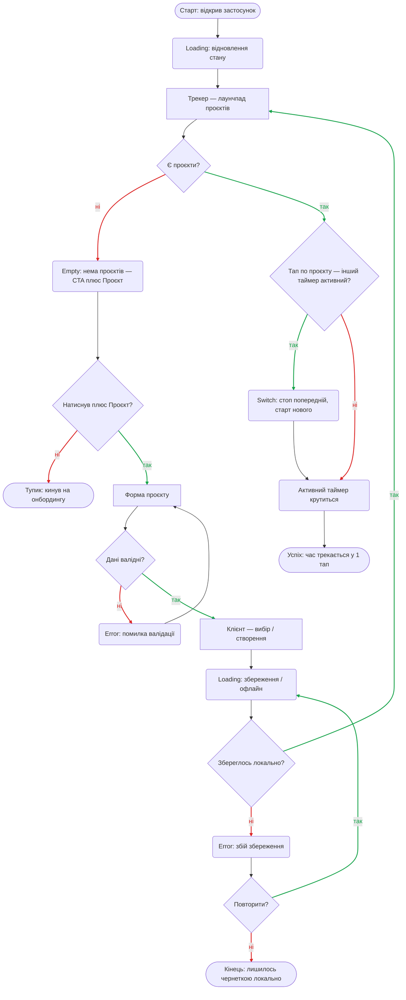
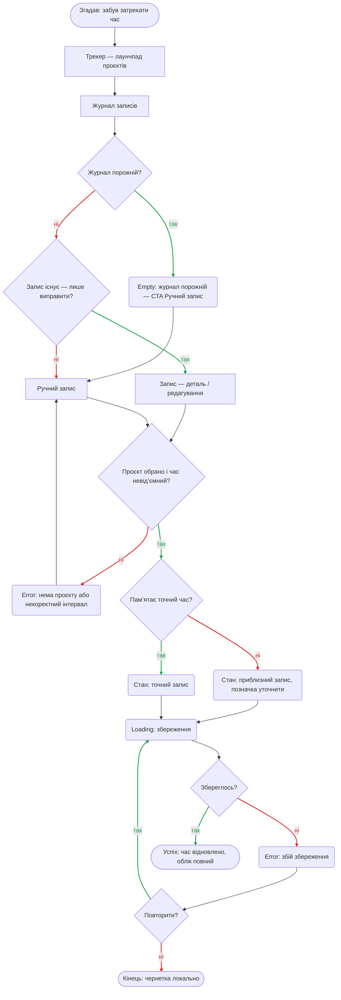
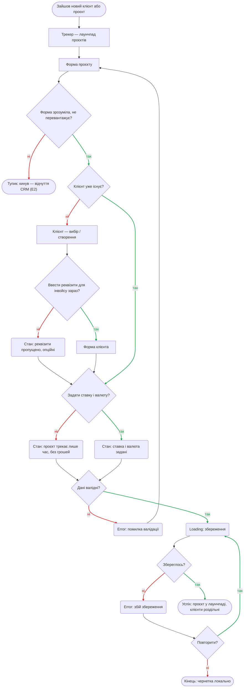
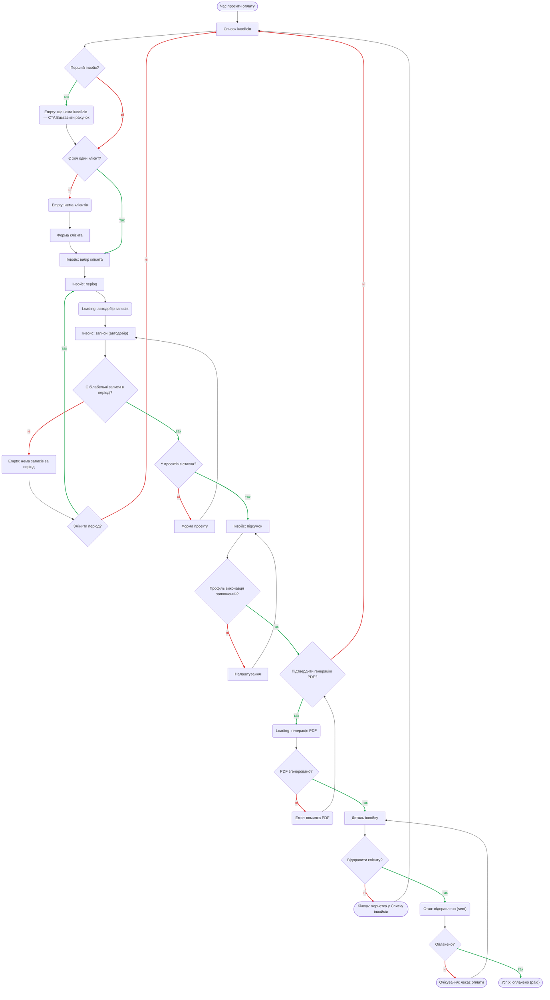
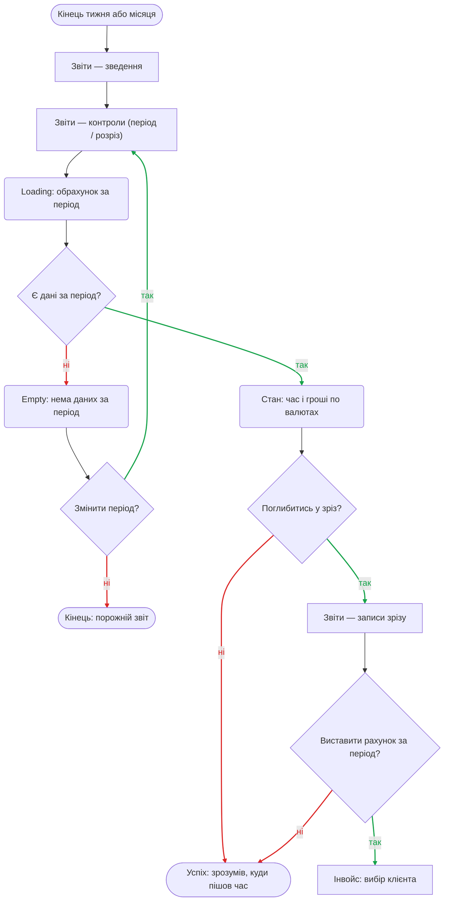

# User Flows — TrackOn

User flows на Mermaid (`flowchart TD`), згруповані за **job** із [`research/jtbd.md`](research/jtbd.md).
Усі вузли-екрани існують у [`sitemap.md`](sitemap.md) (інвентар екранів, навігація, внутрішні рівні, трасування).

**Легенда форм:**
- `["Екран"]` — екран/підекран зі sitemap.md
- `{"Питання?"}` — точка рішення (гілки `так` / `ні`)
- `("Стан")` — стан екрана: **Empty** (нічого не знайшлось), **Error** (збій/відмова), **Loading** (чекаємо)
- `(["Кінець"])` — термінал: **✅ Успіх** · **⛔ Тупик** (застряг) · **Нейтральний кінець** (пауза з поверненням)

> Ревізія після критики: усі глухі Empty/Error отримали вихід; стани empty/error/loading дозбирано;
> потік інвойсу більше не лишає порожню шапку (перевірка профілю) і не має фальш-тупиків (чернетка/очікування повертаються).

---

## R1 — Почати облік, не втрачаючи фокус (+ Main)

- **Рішення:** Є проєкти? · Натиснув «+ Проєкт»? · Дані валідні? · Збереглось локально? · Повторити (на збої)? · Тап-проєкт — інший таймер активний?
- **Стани:** Loading — відновлення стану (старт читає IndexedDB); Empty — нема проєктів (**з CTA**); Error — валідація; Loading — збереження/офлайн; Error — збій збереження; Switch; Активний таймер.
- **Кінці:** ✅ час трекається у 1 тап. ⛔ *Тупик* — кинув на онбордингу (тепер **малоймовірно**: Empty несе явний «+ Проєкт»). ◻️ нейтральний — лишилось чернеткою локально (на відмові від retry).

---

## R2 — Відновити час, який забув зафіксувати

- **Рішення:** Журнал порожній? · Запис існує — лише виправити? · Проєкт обрано і час невідʼємний? · Памʼятає точний час? · Збереглось? · Повторити?
- **Стани:** Empty — журнал порожній (CTA); Error — нема проєкту / некоректний інтервал; приблизний запис (уточнити); точний запис; Loading — збереження; Error — збій збереження.
- **Кінці:** ✅ час відновлено — **точно АБО приблизно** (глухого кута «не згадав» більше нема: система дозволяє приблизний запис). ◻️ чернетка локально (відмова retry).

---

## R3 — Тримати роботу різних клієнтів роздільно й прозоро

- **Рішення:** Форма не перевантажує? · Клієнт існує? · Реквізити зараз? · Задати ставку і валюту? · Дані валідні? · Збереглось? · Повторити?
- **Стани:** реквізити пропущено (опційні); лише час без грошей (`hourlyRate=null`); ставка+валюта задані; Error — валідація; **Loading — збереження**; **Error — збій збереження** (дозбирано до рівня R1).
- **Кінці:** ✅ проєкт у лаунчпаді, клієнти роздільні. ⛔ *Тупик* — кинув через «відчуття CRM» (мітигація: форма мінімальна, не блокує). ◻️ чернетка локально.

---

## R4 — Перетворити час на оплату без ручного зведення

- **Рішення:** Перший інвойс? · Є хоч один клієнт? · Є білабельні записи? · Змінити період? · У проєктів є ставка? · Профіль виконавця заповнений? · Підтвердити PDF? · PDF згенеровано? · Відправити? · Оплачено?
- **Стани:** Empty — нема інвойсів (CTA); **Empty — нема клієнтів**; **Loading — автодобір записів**; Empty — нема записів за період (**з виходом**); **профіль порожній → Налаштування**; Loading — генерація PDF; Error — помилка PDF; sent.
- **Кінці:** ✅ оплачено (paid). ◻️ чернетка у Списку (ребро **назад до Списку**). ◻️ чекає оплати (ребро **назад у Деталь** — пізніше paid). **Тупиків-без-виходу нема:** порожній період → змінити; нема ставки → Форма проєкту; порожня шапка → Налаштування; нема клієнтів → Форма клієнта.

---

## R5 — Зрозуміти, куди насправді пішов мій час

- **Рішення:** Є дані за період? · Змінити період? · Поглибитись у зріз? · Виставити рахунок за період?
- **Стани:** **Loading — обрахунок за період**; Empty — нема даних за період; зведення «час і гроші по валютах».
- **Кінці:** ✅ зрозумів, куди пішов час (+ крос-вхід у R4). ◻️ порожній звіт — **не тупик**: вихід «Змінити період» доступний, людина свідомо завершує.
