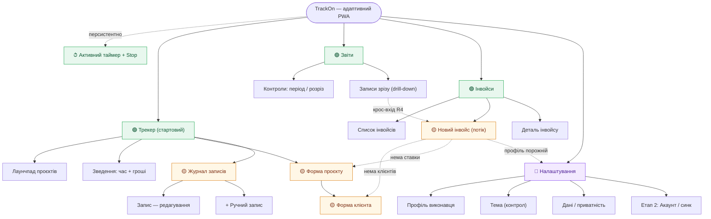
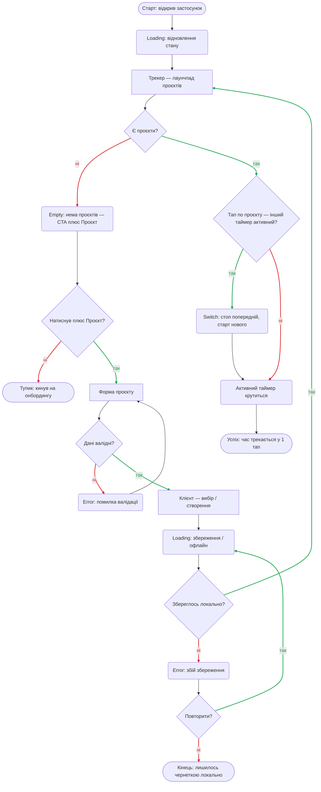
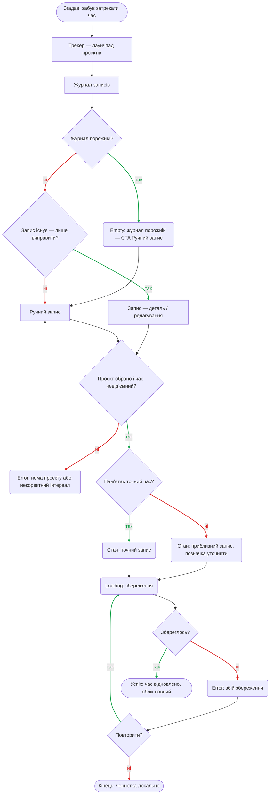
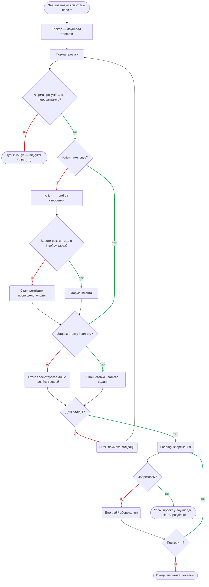
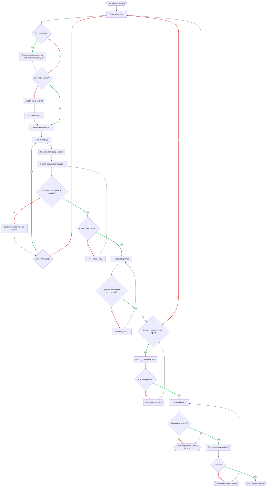
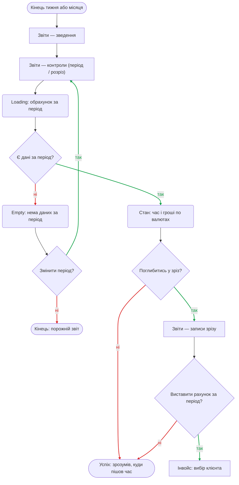

# Information Architecture — TrackOn

Єдине дерево навігації **продукту** (застосунок TrackOn), що зводить **усі екрани** зі
[`sitemap.md`](sitemap.md) (інвентар · навігація · внутрішні рівні) і [`flows.md`](flows.md) (user flows).
Стани (empty / loading / error) — **не екрани**; повний перелік у `sitemap.md` «Внутрішні рівні».

**Легенда:**
- 🟢 **Глобальне** — видно завжди (нижня панель / сайдбар): 3 входи.
- 🟡 **Контекстне** — вхід у потоці, не в головному меню (форми, журнал, кроки інвойсу).
- 🔵 **Глибоке** — рідкісне (Налаштування).
- ⏱ **Персистентне** — присутнє на кожному екрані (індикатор активного таймера + Stop).
- `⇢` контекстний перехід · `→` крос-вхід між кластерами · `R#` job із [`jtbd.md`](research/jtbd.md).

```
TrackOn  (адаптивний PWA · офлайн-first · стартовий екран = Трекер)
│
├─ ⏱ Активний таймер — індикатор + Stop                  персистентно, на кожному екрані   R1
│
├─ 🟢 ТРЕКЕР (Головний)                                   global                            R1 · Main
│   ├─ Лаунчпад проєктів (плитки / список, ▶/⏸)                                              R1
│   ├─ Зведення «час + гроші по валютах»                                                     Main
│   ├─ 🟡 + Проєкт → Форма проєкту                                                           R3 · Main/R4
│   │      └─ 🟡 Клієнт — вибір / створення → Форма клієнта                                  R3 · S1
│   └─ 🟡 Журнал записів (вкладка)                                                           R2 · E1
│          ├─ Запис — деталь / редагування                                                  R2 · E1
│          └─ + Ручний запис                                                                 R2
│
├─ 🟢 ЗВІТИ                                               global                            R5
│   ├─ Контроли (період / розріз)                                                           R5
│   └─ Записи зрізу (drill-down)                                                            R5
│          └─ → «Виставити рахунок за період» ⇢ Інвойси                                      R4 (крос-вхід)
│
├─ 🟢 ІНВОЙСИ                                             global                            R4 · S1 · E1
│   ├─ Список інвойсів (за статусом)                                                        R4 · S1
│   ├─ 🟡 Новий інвойс (потік):
│   │      вибір клієнта → період → записи (автодобір) → підсумок → PDF                      R4
│   │      ├─ (нема клієнтів)    ⇢ Форма клієнта                                             R3
│   │      ├─ (нема ставки)      ⇢ Форма проєкту                                             R4
│   │      └─ (профіль порожній) ⇢ Налаштування                                             R4 · S1
│   └─ Деталь інвойсу (unpaid → sent → paid)                                                R4 · S1
│
└─ 🔵 НАЛАШТУВАННЯ                                        deep                              R4/S1 [?]
    ├─ Профіль виконавця (реквізити шапки інвойсу)                                          R4 · S1
    ├─ Тема (light / dark / auto) — контрол                                                 не job (утиліта)
    ├─ Дані / приватність (локально на пристрої)                                            E3 [?]
    └─ [Етап 2, поза MVP] Акаунт / синк                                                     HJ2 [?]
```

## Діаграма дерева

Те саме дерево як діаграма (рендериться на GitHub). Суцільні стрілки — навігація; пунктир — крос-входи з [`flows.md`](flows.md).



## Оболонка навігації
- **🟢 Глобальна (завжди):** ⏱ Активний таймер · Трекер · Звіти · Інвойси. Стартовий екран — **Трекер** (1-тап-старт main job).
- **🟡 Контекстна:** форми (проєкт, клієнт), Журнал записів, кроки потоку інвойсу — з'являються поряд з об'єктом, не в головному меню.
- **🔵 Глибока:** Налаштування — з overflow/профілю, рідко.

## Крос-входи (з [`flows.md`](flows.md))
- **Звіти → Інвойси:** «Виставити рахунок за період» (R4) — з drill-down зрізу.
- **Потік інвойсу ⇢** Форма клієнта (нема клієнтів) · Форма проєкту (нема ставки) · Налаштування (профіль порожній → шапка інвойсу неповна).

## Глибина
Main job (затрекати) — **1 тап** з Трекера. Найглибша часта дія — інвойс — **3 тапи**. Підрахунок — у `sitemap.md` «Навігація».

## Покриття
17 екранів зі `sitemap.md`/`flows.md` + підекрани Налаштувань — усі в дереві. Жодного осиротілого:
`Тема` лишена контролом (не екран); решта мають job.

---

## Флоу-діаграми

Шляхи людини між екранами дерева, за job. Повні списки рішень/станів і легенда форм — у
[`flows.md`](flows.md) (це джерело істини; нижче — ті самі діаграми для контексту IA).

### R1 — Почати облік, не втрачаючи фокус (+ Main)



### R2 — Відновити час, який забув зафіксувати



### R3 — Тримати роботу різних клієнтів роздільно й прозоро



### R4 — Перетворити час на оплату без ручного зведення



### R5 — Зрозуміти, куди насправді пішов мій час


